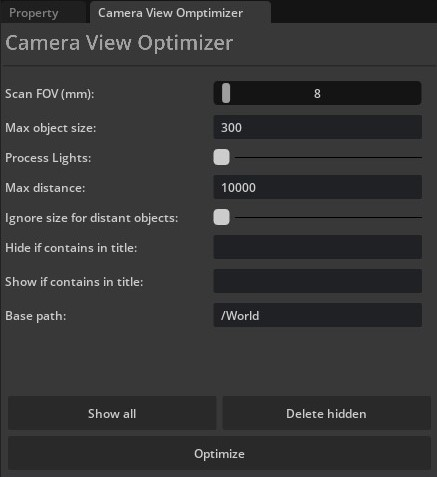

# Camera View Optimizer

### About
Omniverse extensions that allow you to quickly hide/delete objects that are not visible to the camera to save performance and VRAM.

## Quick links

* [Installation](#installation)
* [How to use](#how-to-use)
* [Linking with an Omniverse app](#linking-with-an-omniverse-app)
* [Contributing](#contributing)
* [Changelog](CHANGELOG.md)

## Installation
To add a this extension to your Omniverse app:
### From Community tab (Not available at the moment)
1. Go to **Extension Manager** (Window - Extensions) — Community tab
2. Search for **Camera View Optimizer** extension and enable it
### Manual
1. Go to **Extension Manager** (Window - Extensions) — **Gear Icon** — **Extension Search Path**
2. Add this as a search path: 
    ```
    git://github.com/Vadim-Karpenko/omniverse-camera-view-optimizer?branch=main&dir=exts
    ```
3. Search for **Camera View Optimizer** extension and enable it

A new window will appear next to the Properties tab:




## How to use
- Open a scene you want to optimize
- Open an extension window
- The current view in the viewport is used to scan for visible objects, so make sure your camera is positioned correctly.
- Make sure settings are set correctly. Hover over each option to read about what it does.
- Click **Optimize** button.

**Hide if contains in title** and **Show if contains in title** fields support a regular expressions (regex) that allows you to filter any object based on its title, with any pattern, simple or complex.

Regex examples:
- `(^Abs.*)` - all names starting with `Abs`
- `(.*nt$)` - all names ending with `nt`
- `(.*ph.*)` - contains `ph`
- `(.*\d.*)` - contains any number
- `(^((?!tree).)*$)` - any title that does not contain `tree`.

You can also combine multiple conditions:
- `(.*El.*|t1$)` - Has `El` **OR** ends with `t1`
- `(.*El.*)(t1$)` - Has `El` **AND** ends with `t1`

## Linking with an Omniverse app

For a better developer experience, it is recommended to create a folder link named `app` to the *Omniverse Kit* app installed from *Omniverse Launcher*. A convenience script to use is included.

Run:

```bash
> link_app.bat
```

There is also an analogous `link_app.sh` for Linux. If successful you should see `app` folder link in the root of this repo.

If multiple Omniverse apps is installed script will select recommended one. Or you can explicitly pass an app:

```bash
> link_app.bat --app code
```

You can also just pass a path to create link to:

```bash
> link_app.bat --path "C:/Users/bob/AppData/Local/ov/pkg/create-2022.1.3"
```


## Contributing
Feel free to create a new issue if you run into any problems. Pull requests are welcomed.
